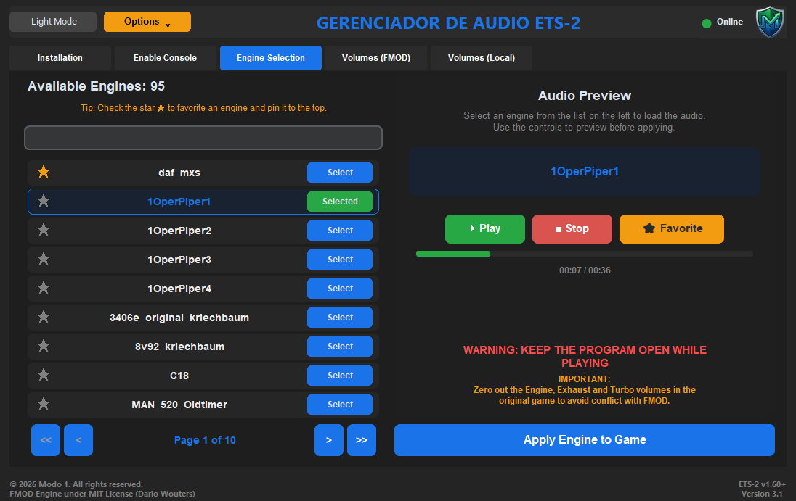

  <h1>🚛 Gerenciador de Motores ETS-2 (Engine Manager)</h1>
  
Uma ferramenta completa para gerenciar sons de motores e volumes FMOD no Euro Truck Simulator 2.

  
<i>A complete tool to manage engine sounds and FMOD volumes in Euro Truck Simulator 2.</i>

  
    

  
  
  
  
  

 

  <!-- Substitua o link abaixo pela sua imagem -->
  

 

## 🇧🇷 Sobre o Projeto (About in Portuguese)

O **Gerenciador de Motores** evoluiu de uma simples ferramenta para um aplicativo desktop comercial robusto projetado para os jogadores de **Euro Truck Simulator 2 (ETS-2)**. Com uma interface moderna, ele permite gerenciar sons, instalar plugins e ajustar volumes do FMOD, tudo isso rodando sob uma infraestrutura segura na nuvem.

### ✨ Principais Recursos
- 🛡️ **Sistema Anti-Cheat e Nuvem:** Validação de Hardware ID (HWID) integrada com banco de dados Supabase para prevenir uso não autorizado e manipulação de memória.
- 🎨 **Interface Premium e Bilíngue:** Suporte completo para Português (PT-BR) e Inglês (US) com troca instantânea, além de temas dinâmicos (Claro/Escuro).
- ⚙️ **Instalação Automática:** Instale a .dll do plugin FMOD com um clique, graças ao módulo de detecção inteligente das pastas do jogo.
- 🎛️ **Gerenciamento de Áudio:** Selecione mods de som, ouça prévias e altere os volumes do motor, escapamento e turbo, sincronizando diretamente com seus perfis locais.
- ⚖️ **Propriedade Intelectual:** Aplicativo de Código Fechado (Proprietário) blindado contra engenharia reversa.

---

## 🇺🇸 About the Project (About in English)

The **Engine Manager** has evolved from a simple tool into a robust commercial desktop application designed for **Euro Truck Simulator 2 (ETS-2)** players. With a modern interface, it allows you to manage sounds, install plugins, and adjust FMOD volumes, all running under a secure cloud infrastructure.

### ✨ Key Features
- 🛡️ **Anti-Cheat & Cloud System:** Hardware ID (HWID) validation integrated with a Supabase database to prevent unauthorized access and memory tampering.
- 🎨 **Premium Bilingual Interface:** Full support for Portuguese (PT-BR) and English (US) with instant switching, plus dynamic Dark/Light themes.
- ⚙️ **Automatic Installation:** Install the required FMOD .dll plugin with one click, powered by a smart game folder detection module.
- 🎛️ **Audio Management:** Select sound mods, listen to previews, and adjust engine, exhaust, and turbo volumes, syncing directly to your local profiles.
- ⚖️ **Intellectual Property:** Closed Source (Proprietary) application shielded against reverse engineering.

---

## 🤝 Créditos e Agradecimentos / Credits and Acknowledgments

Este projeto utiliza o incrível **Plugin FMOD para ETS-2/ATS**, criado por [dariowouters](https://github.com/dariowouters/ts-fmod-plugin?tab=readme-ov-file). 
O Gerenciador de Motores atua como uma interface visual (GUI) avançada para facilitar a configuração e o uso do plugin desenvolvido por ele.

*This project utilizes the amazing **FMOD Plugin for ETS-2/ATS**, created by [dariowouters](https://github.com/dariowouters/ts-fmod-plugin?tab=readme-ov-file). 
The Engine Manager acts as an advanced graphical user interface (GUI) to make configuring and using his plugin much easier.*

**Plugin Repository:** [dariowouters/ts-fmod-plugin](https://github.com/dariowouters/ts-fmod-plugin/releases)

---

  <h2>⬇️ Download do Programa</h2>
  
Para baixar a versão mais recente e pronta para uso, clique no botão abaixo:

  
  
  
<i>Após o download, basta extrair a pasta e executar o programa.</i>

