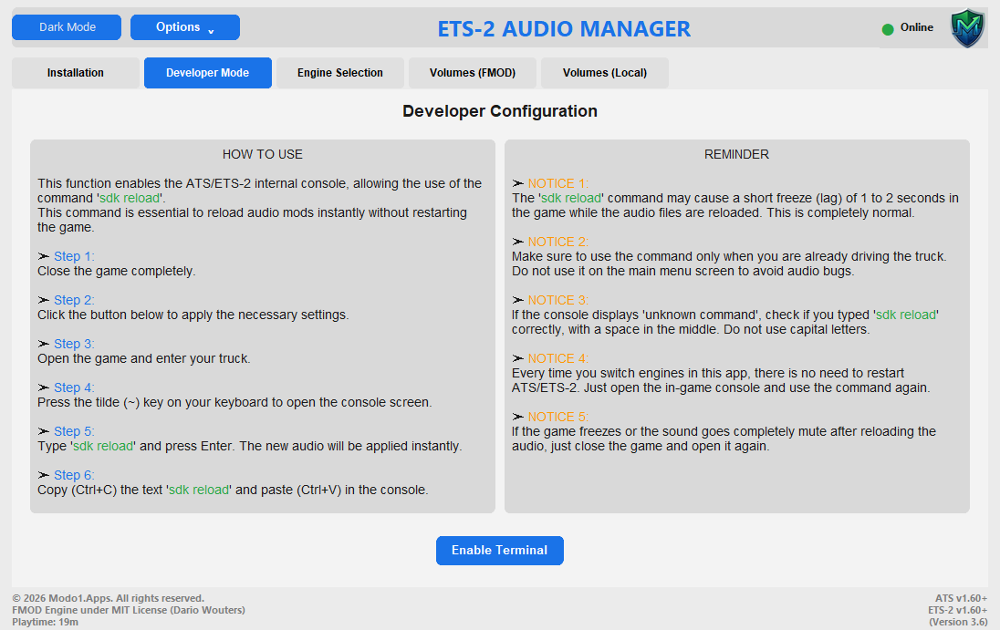
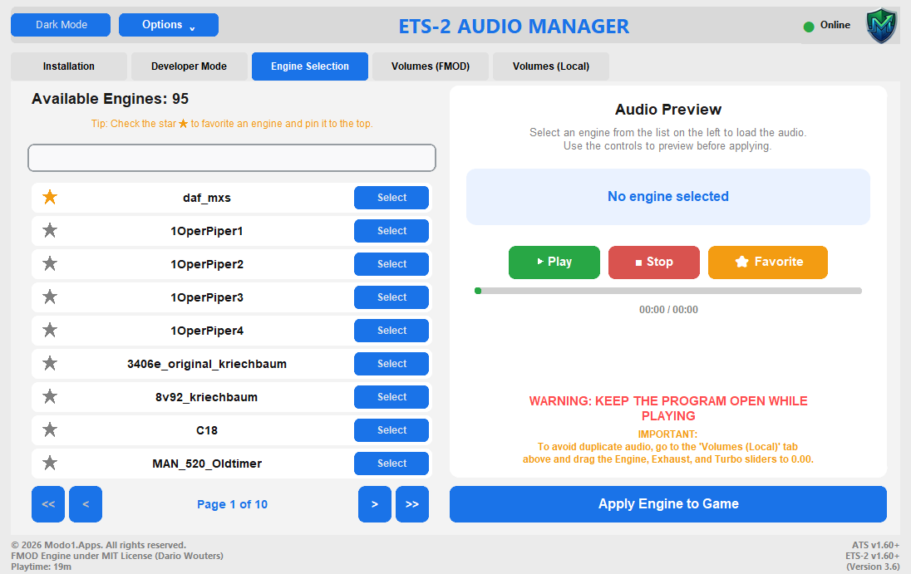

  <h1>🚛 Gerenciador de Motores (ATS / ETS-2)</h1>
  
Uma ferramenta completa para gerenciar sons de motores e volumes FMOD no American Truck Simulator e Euro Truck Simulator 2.

  
<i>A complete tool to manage engine sounds and FMOD volumes in American Truck Simulator and Euro Truck Simulator 2.</i>

  
    

  <h2>⬇️ DOWNLOAD / BAIXAR PROGRAMA</h2>
  
  
<b>🇧🇷 Instruções:</b> Clique no botão acima para baixar. Após o download, basta <b>descompactar o arquivo .zip</b> e executar o programa (não precisa instalar).

  
<b>🇺🇸 Instructions:</b> Click the button above to download. After downloading, simply <b>unzip the .zip file</b> and run the program (no installation required).

   

  
  
  
  
  

 

  
    
  
    
  

 

## 🇧🇷 Sobre o Projeto (About in Portuguese)

O **Gerenciador de Motores** é o aplicativo definitivo para os jogadores de **American Truck Simulator (ATS)** e **Euro Truck Simulator 2 (ETS-2)** que buscam a melhor experiência sonora. Com uma interface moderna e amigável, ele permite gerenciar sons de motores, instalar plugins FMOD e ajustar volumes de forma rápida e segura.

### ✨ Principais Recursos
- 🚚 **Suporte a Múltiplos Jogos:** Funciona perfeitamente com o American Truck Simulator e o Euro Truck Simulator 2. A troca de jogos é feita em um clique!
- 🎛️ **Controle Total de Áudio:** Selecione os sons mais incríveis, ouça prévias e altere os volumes do motor, escapamento e turbo.
- ⚙️ **Instalação Automática:** Esqueça processos complicados manuais! O programa encontra a pasta do seu jogo na Steam e instala o que for necessário automaticamente.
- 🎨 **Interface Moderna e Bilíngue:** Design limpo e intuitivo com suporte completo para Português (PT-BR) e Inglês (US), além de temas dinâmicos (Claro/Escuro).
- ☁️ **Atualizações pela Nuvem:** Suas licenças e atualizações são validadas de forma transparente na nuvem para garantir que você sempre tenha a melhor versão.

---

## 🇺🇸 About the Project (About in English)

The **Engine Manager** is the ultimate application for **American Truck Simulator (ATS)** and **Euro Truck Simulator 2 (ETS-2)** players seeking the best audio experience. With a modern and user-friendly interface, it allows you to easily manage engine sounds, install FMOD plugins, and adjust volumes safely and quickly.

### ✨ Key Features
- 🚚 **Multi-Game Support:** Works flawlessly with both American Truck Simulator and Euro Truck Simulator 2. Switch between games with a single click!
- 🎛️ **Total Audio Control:** Select the most amazing sounds, listen to previews, and adjust engine, exhaust, and turbo volumes.
- ⚙️ **Automatic Installation:** Forget complicated manual setups! The program automatically detects your Steam game folder and installs everything you need.
- 🎨 **Modern Bilingual Interface:** Clean and intuitive design with full support for Portuguese (PT-BR) and English (US), plus dynamic Dark/Light themes.
- ☁️ **Cloud Updates:** Your licenses and updates are seamlessly validated in the cloud to ensure you always have the best version.

---

## 🤝 Créditos e Agradecimentos / Credits and Acknowledgments

Este projeto utiliza o incrível **Plugin FMOD para ETS-2/ATS**, criado por [dariowouters](https://github.com/dariowouters/ts-fmod-plugin?tab=readme-ov-file). 
O Gerenciador de Motores atua como uma interface visual (GUI) avançada para facilitar a configuração e o uso do plugin desenvolvido por ele.

*This project utilizes the amazing **FMOD Plugin for ETS-2/ATS**, created by [dariowouters](https://github.com/dariowouters/ts-fmod-plugin?tab=readme-ov-file). 
The Engine Manager acts as an advanced graphical user interface (GUI) to make configuring and using his plugin much easier.*

**Plugin Repository:** [dariowouters/ts-fmod-plugin](https://github.com/dariowouters/ts-fmod-plugin/releases)

